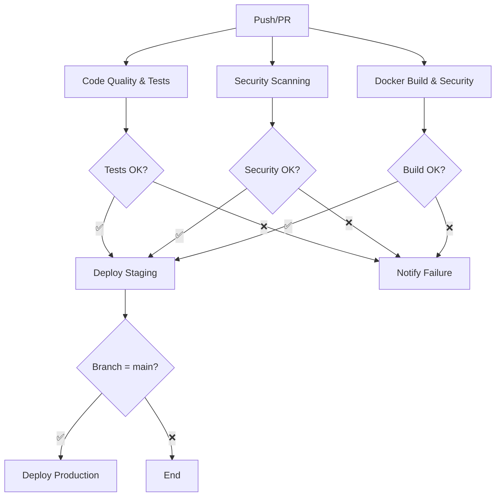

# 🚀 Pipeline CI/CD DevSecOps - Guide Complet

## 📋 Vue d'ensemble

Cette pipeline CI/CD DevSecOps implémente les meilleures pratiques pour votre application Flask, incluant :

- **Tests automatisés** avec couverture de code
- **Qualité de code** (Black, isort, flake8)
- **Scans de sécurité** multiples (Bandit, Safety, Trivy, GitLeaks)
- **Déploiement automatisé** multi-environnements
- **Monitoring** et notifications

## 🏗️ Architecture de la Pipeline



## 🎯 Jobs de la Pipeline

### 1. 🧪 Code Quality & Tests
- **Durée**: ~3-5 minutes
- **Service**: PostgreSQL pour les tests
- **Étapes**:
  - Installation des dépendances Python
  - Vérification du formatage (Black)
  - Vérification du tri des imports (isort)
  - Linting (flake8)
  - Exécution des tests avec couverture (80% minimum)
  - Upload des rapports de couverture

### 2. 🔒 Security Scanning
- **Durée**: ~2-3 minutes
- **Outils**:
  - **Bandit**: Analyse de sécurité du code Python
  - **Safety**: Vérification des vulnérabilités des dépendances
  - **GitLeaks**: Détection de secrets dans le code
- **Rapports**: Générés et uploadés comme artefacts

### 3. 🐳 Docker Build & Security
- **Durée**: ~5-7 minutes
- **Étapes**:
  - Build multi-stage optimisé
  - Cache Docker intelligent
  - Scan Trivy des images
  - Scan Trivy du filesystem
  - Upload des résultats vers GitHub Security

### 4. 🚀 Déploiement
- **Staging**: Automatique sur `develop`
- **Production**: Automatique sur `main`
- **Registry**: GitHub Container Registry
- **Environnements protégés** avec approbations

## 🛠️ Configuration Requise

### GitHub Repository Settings

1. **Secrets nécessaires**:
   ```bash
   # Optionnel - pour des registries externes
   DOCKER_USERNAME
   DOCKER_PASSWORD
   
   # Pour les déploiements
   SSH_PRIVATE_KEY
   SERVER_HOST
   ```

2. **Environments**:
   - `staging`: Protection optionnelle
   - `production`: Protection requise + reviewers

3. **Branch Protection** (recommandé):
   ```yaml
   main:
     - Require status checks
     - Require up-to-date branches
     - Require review from CODEOWNERS
   ```

### Dependabot Configuration
Le fichier `.github/dependabot.yml` est configuré pour :
- Mises à jour hebdomadaires des dépendances Python
- Mises à jour des actions GitHub
- Mises à jour des images Docker

## 🧪 Tests Locaux

### Script de Test Rapide
```bash
# Rendre le script exécutable
chmod +x scripts/local-test.sh

# Exécuter la simulation complète
./scripts/local-test.sh
```

### Tests Manuels par Étape

```bash
# 1. Qualité de code
black --check .
isort --check-only .
flake8 .

# 2. Tests avec couverture
pytest src/tests/ --cov=src --cov-report=term-missing

# 3. Sécurité
bandit -r src/
safety check

# 4. Docker
docker build -t flask-api:test .
docker run --rm -p 5000:5000 flask-api:test
```

## 📊 Monitoring et Métriques

### Métriques Collectées
- **Couverture de code**: Minimum 80%
- **Temps de build**: Objectif < 10 minutes
- **Taux de succès**: Objectif > 95%
- **Vulnérabilités**: Zéro tolérance pour CRITICAL

### Rapports Générés
- **Coverage Report**: `htmlcov/index.html`
- **Security Reports**: `bandit-report.json`, `safety-report.json`
- **SARIF Reports**: Intégrés dans GitHub Security

## 🔧 Optimisations

### Cache Docker
- **GitHub Actions Cache**: Réutilise les layers Docker
- **Multi-stage Build**: Sépare build et runtime
- **Base Images**: Scan automatique des vulnérabilités

### Parallélisation
- Jobs indépendants exécutés en parallèle
- Tests distribués avec pytest-xdist
- Build optimisé avec BuildKit

## 🚨 Gestion des Échecs

### Stratégies de Retry
```yaml
# Dans les jobs sensibles
- uses: nick-invision/retry@v2
  with:
    timeout_minutes: 5
    max_attempts: 3
    command: pytest src/tests/
```

### Notifications
- **Slack**: Webhooks pour les équipes
- **Email**: Notifications GitHub natives
- **Pull Requests**: Commentaires automatiques

## 🔄 Workflow de Développement

### Branches et Déploiements
```bash
feature/* → develop → staging environment
develop → main → production environment
```

### Pull Request Workflow
1. **Création PR**: Triggers tous les checks
2. **Review**: Obligatoire pour main
3. **Merge**: Auto-deploy si tous les checks passent

## 📈 Amélioration Continue

### Métriques à Surveiller
- Temps de cycle (commit → production)
- Fréquence des déploiements
- Taux d'échec des déploiements
- Temps de récupération (MTTR)

### Prochaines Étapes
- [ ] Tests d'intégration E2E
- [ ] Déploiement Blue-Green
- [ ] Feature flags
- [ ] Monitoring applicatif (Prometheus/Grafana)
- [ ] Tests de charge automatisés

## 🆘 Troubleshooting

### Problèmes Courants

**Tests en échec**:
```bash
# Vérifier la base de données de test
docker-compose -f docker-compose.test.yml up -d
pytest src/tests/ -v -s
```

**Build Docker lent**:
```bash
# Nettoyer le cache
docker builder prune
docker system prune -f
```

**Scan de sécurité en échec**:
```bash
# Mettre à jour les dépendances
pip-audit --fix
safety check --full-report
```

## 📞 Support

- **Documentation**: Ce fichier + README.md
- **Issues**: GitHub Issues pour les bugs
- **Discussions**: GitHub Discussions pour les questions

---

**✨ Cette pipeline suit les standards DevSecOps et les best practices de l'industrie !** 